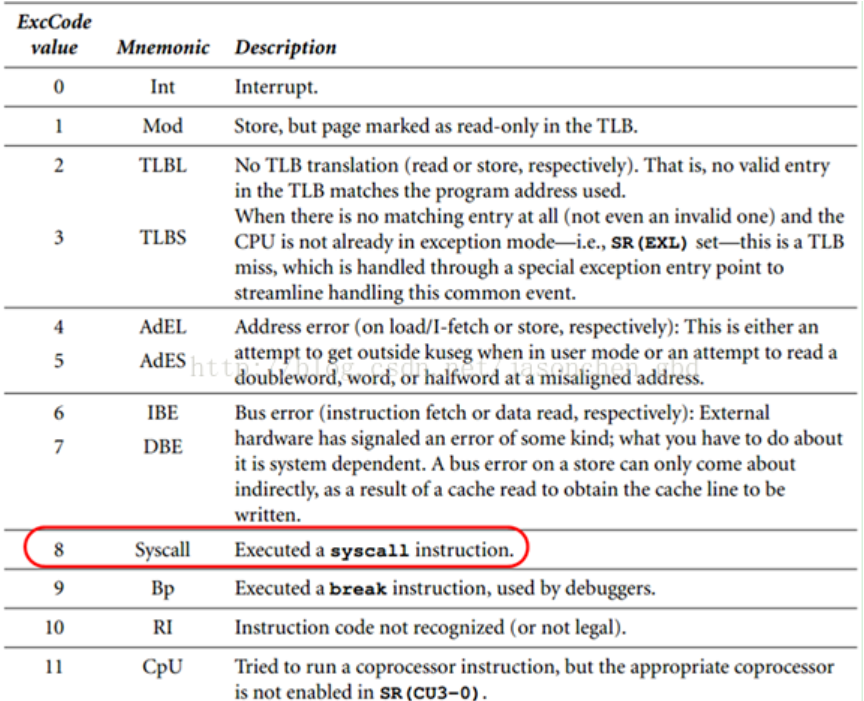

# lab4做了什么

## 支持缺页中断处理

## 完成基本的系统调用

我认为系统调用的实质就是用户态的进程想使用一些内核态下的功能,比如分配内存空间,创建进程等等,但是由于操作系统要保障**安全性**,所以这些接口不能向用户程序开放,所以采用一个折中的方法,即**系统调用**,用户将一些必要的信息以**参数的形式**传递给内核,内核判断你的操作是否**合法**,合法则执行并将结果返回给用户,否则拒绝执行

## 实现fork

`fork`就是**以父进程为模板**创建一个与其**高度相似**的子进程,其关键的一点特性是**父子进程中的`fork`返回值不同**,这也是区分父子进程的方法

## 实现进程间通信

通信本质上就是**在进程间传递一个数值**, 通过**共享内存**来实现, 共享的是所有进程都存在的内核中的2G空间中的一个位置

(搞懂再写)

# 提前准备的知识

## MIPS下C与汇编的参数传递

首先介绍两个关于MIPS汇编的宏定义 

```C
//include/asm/asm.h
// 用来定义全局叶子汇编函数 : 即在函数内部不需要调用其他函数
#define LEAF(symbol)                                    \
                .globl  symbol;                         \
                .align  2;                              \
                .type   symbol,@function;               \
                .ent    symbol,0;                       \
symbol:         .frame  sp,0,ra
// 用来定义全局非叶子汇编函数 : 即在函数内部还调用其他函数 
// 所以在该宏定义结构中已经做了对栈指针的处理
#define NESTED(symbol, framesize, rpc)                  \
                .globl  symbol;                         \
                .align  2;                              \
                .type   symbol,@function;               \
                .ent    symbol,0;                       \
symbol:         .frame  sp, framesize, rpc
// 函数结尾
#define END(function)                                   \
                .end    function;                       \
                .size   function,.-function
```

**注意我们一般而言只有在接近底层时才有使用到汇编来实现,所以大部分汇编功能都能通过叶子函数完成**

1. C函数之间的调用 : 

   所有的参数传递以及返回值的维护由编译器隐式的实现,不需要考虑

2. MIPS汇编之间的调用

   * 调用者需要在代码中显式的在栈中保存受保护寄存器,返回值寄存器等,然后显式的向`$a0-$a3`中写入参数值,然后调用,返回时要恢复现场

   * 被调用者需要显式的获取参数

   * 参数较多时通过栈传递

   其实就是**调用者与被调用者遵守并显式的实现统一的调用规则**

3. **C调用MIPS汇编函数** : 最常见的一种情况(依据`o32ABI`的约定)

   * 调用者(即C函数) : 
     1. 在栈上创建一个容纳参数的空间,从`sp`指向的位置开始,第一个参数(即C源码中最左侧的参数)位于最低地址处,**每个参数至少占据一个字的大小空间**
     2. **为任何一个调用都至少分配16字节的栈参数空间,即使没有这么多参数**
     3. **实际上优先通过的是寄存器传递参数,即参数结构的前16个字节(即4个字)保存在`$a0-$a3`的寄存器结构中,而栈中的前16个字节的内容未定义,但是其结构必须保存**
   * 被调用者(MIPS函数)
     1. 可以选择盲目的将`$a0-$a3`的写入栈中,也可以不写(取决于该汇编函数的功能)
     2. **前4个参数从寄存器获得,之后的参数从栈中获得**

   // 他说此处应该有个图

4. MIPS汇编函数调用C函数 :

   * 调用者(即MIPS汇编代码) : 将参数按照C函数的定义从左向右的顺序存入`$a0-$a3`寄存器中,如果要求在调用结束后保存某些寄存器则要使用栈区保存(**注意`ra`寄存器是一定要保存的,并在调用结束之后要恢复**),然后直接跳转到C函数的入口地址处即可

     注 : 具体实现方法为**在.S文件中使用`extern`外联定义C函数`c_method()`,然后直接使用`jal c_method`即可**(因为`jal`会写入返回地址到`$ra`中,而C函数在最后会自动调用`jr ra`)

   * 被调用者(C函数) : 不用做任何特殊处理,正常编写即可

## 异常处理流程

**时钟中断,系统调用,以及在指令执行中出现的错误都作为一种异常处理**

### 异常处理程序地址

```c
//tools/sces0_3.lds
SECTIONS
{
  . = 0x80000080;
  .except_vec3 : {
	*(.text.exc_vec3)
  }// 可见我们将所有exc_vec3代码段加载到了0x80000080地址处,而这些代码就是最基本的异常处理程序(异常分发程序),实际上该处的代码并没有真正处理异常,只是根据异常类型将其分发给特定的异常处理程序
  // other code
}
```

这个地址`0x80000080`是当异常发生时`CPU`将`PC`跳转到的地址(由`MIPS R3000 CPU`的设计决定的)

即异常发生时 : **首先是硬件发挥作用,即CPU进行以下行为** : 

1. 设置`EPC`为异常处理结束后重新开始的程序地址
2. 设置`CP0`的`SR`寄存器中的`EXL`位使得`CPU`进入内核态**禁止中断**
3. 设置`CP0`的`CAUSE`寄存器编码为异常产生原因
4. 设置`PC`值为异常处理程序的入口地址(在此处即`0x80000080`)

### 异常类型注册表

```c
//lib/traps.c
extern void handle_int();
extern void handle_reserved();
extern void handle_tlb();
extern void handle_sys();
extern void handle_mod();
// 以上具体的实现在外部函数实现
/* 这个数组即是异常向量
 * 向量下标与CAUSE寄存器中的异常类型编号对用
 * 向量每一项为对应异常种类的处理程序的入口地址
*/
unsigned long exception_handlers[32];
void trap_init(){
	int i;
	for(i=0;i<32;i++)
	set_except_vector(i, handle_reserved);
	set_except_vector(0, handle_int);
	set_except_vector(1, handle_mod);
	set_except_vector(2, handle_tlb);
	set_except_vector(3, handle_tlb);
	set_except_vector(8, handle_sys);
}
void *set_except_vector(int n, void * addr){
	unsigned long handler=(unsigned long)addr;
	unsigned long old_handler=exception_handlers[n];
	exception_handlers[n]=handler;
	return (void *)old_handler;
}
```

注 : 异常类型在`CAUSE`寄存器中对应的编码值



### 异常分发程序

异常发生时**直接跳转到**的函数地址

* 作用 : 根据`CAUSE`寄存器的值判断异常类型并跳转到对应的处理程序去

* 实现 :

  ```c
  //boot/start.S
  .section .text.exc_vec3
  NESTED(except_vec3, 0, sp) // 非叶子函数因为要跳转到
  	.set	noat
  	.set	noreorder
  1:	//j	1b
  	nop
  	mfc0	k1,CP0_CAUSE	    //$k1中存储CAUSE寄存器中的值
  	andi	k1,0x7c			   //$k1中存储异常类型的编码值,具体见下文
  	la	k0,exception_handlers	//$k0中存储异常向量的起始地址(即数组的基址)
  	addu	k0,k1			   //$k0 + $k1 即基址+偏移获得存储(异常处理程序的入口地址)的地址放入$k0中
  	lw	k0,(k0)				   //从该地址中取出异常处理程序的入口地址
  	NOP
  	jr	k0					  //跳转到对应的异常处理程序
  	nop
  	END(except_vec3)
  ```

  注 : 对`andi k1,0x7c`的理解

  1. `CAUSE`寄存器结构如下 :

     

  2. `0x7c = 0x0111_1100`,与该数按位与就是获得`2-6`位的值,从上图可知就是`Exc Code`的值,所以该操作可以获得异常类型的编码值

* 在异常分发完之后就是实际的处理程序的运行了

  处理异常完成之后即可**返回`EPC`保存的地址**

### 流程图示


# 走进lab4 

## 系统调用的基本流程

### 宏观上看一个系统调用的过程

1. 调用一个封装好的用户空间的库函数
2. 调用用户空间的`syscall_*` 函数
3. 调用`msyscall`，用于陷入内核态
4. 陷入内核，内核取得信息，执行对应的内核空间的系统调用函数（`sys_*`）
5. 执行系统调用，并返回用户态，同时将返回值传递回用户态
6. 从库函数返回，回到用户程序调用处

### 代码细节

1. 用户态的行为 : 

   1. 调用`syscall_*`函数,等待返回值(如果有的话)

      **用户空间不负责任何实质的处理,只是准备好参数之后陷入内核态即可**

      **所有的系统调用都是通过`mysyscall`陷入内核,通过第一个参数作为系统调用号来区别不同的系统调用种类**

      ````c
      //user/syscall_lib.c
      //所有函数的调用第一个参数是系统调用号(即系统调用类型)
      //默认所有的调用都有6个参数
      void syscall_yield(void)
      {
      	msyscall(SYS_yield,0,0,0,0,0);
      }
      void syscall_env_destroy(u_int envid)
      {
      	msyscall(SYS_env_destroy,envid,0,0,0,0);
      }
      int syscall_set_pgfault_handler(u_int envid, u_int func, u_int xstacktop)
      {
      	return msyscall(SYS_set_pgfault_handler,envid,func,xstacktop,0,0);
      }
      int syscall_mem_alloc(u_int envid, u_int va, u_int perm)
      {
      	return msyscall(SYS_mem_alloc,envid,va,perm,0,0);
      }
      int syscall_mem_map(u_int srcid, u_int srcva, u_int dstid, u_int dstva, u_int perm)
      {
      	return msyscall(SYS_mem_map,srcid,srcva,dstid,dstva,perm);
      }
      ````

      即用户准备好必要的信息,然后**包装一层**将第一个参数设置为**系统调用号**,然后内核根据系统调用号的值(**偏移**)决定**真正执行功能的函数的入口地址**

      这些系统调用号以一个注册表的形式定义在头文件中 :

      ```c
      //include/unistd.h
      #ifndef UNISTD_H
      #define UNISTD_H
      
      #define __SYSCALL_BASE 9527
      #define __NR_SYSCALLS 20
      #define SYS_putchar 		((__SYSCALL_BASE ) + (0 ) ) 
      #define SYS_getenvid 		((__SYSCALL_BASE ) + (1 ) )
      #define SYS_yield			((__SYSCALL_BASE ) + (2 ) )
      #define SYS_env_destroy		((__SYSCALL_BASE ) + (3 ) )
      #define SYS_set_pgfault_handler	((__SYSCALL_BASE ) + (4 ) )
      #define SYS_mem_alloc		((__SYSCALL_BASE ) + (5 ) )
      #define SYS_mem_map			((__SYSCALL_BASE ) + (6 ) )
      #define SYS_mem_unmap		((__SYSCALL_BASE ) + (7 ) )
      #define SYS_env_alloc		((__SYSCALL_BASE ) + (8 ) )
      #define SYS_set_env_status	((__SYSCALL_BASE ) + (9 ) )
      #define SYS_set_trapframe		((__SYSCALL_BASE ) + (10 ) )
      #define SYS_panic			((__SYSCALL_BASE ) + (11 ) )
      #define SYS_ipc_can_send		((__SYSCALL_BASE ) + (12 ) )
      #define SYS_ipc_recv		((__SYSCALL_BASE ) + (13 ) )
      #define SYS_cgetc			((__SYSCALL_BASE ) + (14 ) )
      #endif
      ```

   2. 调用`msyscall`触发系统调用异常陷入内核态

      ```c
      //user/syscall_wrap.S
      LEAF(msyscall)	//说明该函数是一个全局叶子函数,不需要调用其他函数
      // sw	a0,0(sp)
      // sw	a1,4(sp)
      // sw	a2,8(sp)
      // sw	a3,12(sp)
      // move	v0, a0
      // 将参数存入已经在C函数调用汇编函数时分配好的栈空间中
      // 我认为目的就是稳一手,防止在异常分发程序中使用这些寄存器破坏数据(反正空间都已经在那了)
      // 稳一手把自己稳炸了,不要写上面这些!!!!
      syscall	//触发系统调用异常
      jr	ra
      END(msyscall)
      ```
   ```
   
   * **当调用`syscall`时发生了什么 : **
   
     触发**系统调用异常**按照**上面描述的异常处理流程**将该异常分发到**系统调用处理程序**
   
   * 上述的保存寄存器代码段是依据于系统调用约定 :
   
        1. ~~系统调用号放入`$v0`~~(课上测试不放我有什么办法)
        2. 参数的传递按照`o32ABI`的约定进行 :
        * 在`syscall_lib.c`中C函数调用`msyscall(SYS_*, arg1,...arg5)`时**依据约定栈区划定24字节空间,前4个参数通过`$a0-$a3`传递,后两个参数通过栈区传递**
           * ~~我为什么不能把所有的参数都放进栈中,为什么,艹~~
   ```

2. 内核态的行为

   1. 接下来运行**系统调用异常处理程序**

      ```c
      //lib/syscall.S
      NESTED(handle_sys,TF_SIZE, sp)
      
      //所有的异常处理的第一步都是保存现场(关于保存现场详情移步lab3)
      SAVE_ALL	//保存运行现场,即将寄存器全部压栈
      // 在上述保存过程中
      CLI		    //关闭中断
      
      //1: j 1b
      nop
      .set at
      
      lw t1, TF_EPC(sp)
      addiu t1, 4
      sw	t1, TF_EPC(sp)
      //从保存的现场中取出EPC再+4之后存回,即为异常处理结束之后的重新开始运行的PC值
          
      //从保存的现场中取出$4即$a0的值存入a0当中去
      lw a0, TF_REG4(sp)	//a0即保存的系统调用号
      addiu a0, a0, -SYSCALL_BASE	//获得偏移,即获得了系统调用的具体种类
      sll	t0, a0,2
      la	t1, sys_call_table	//t1为系统调用注册表(即下文的入口地址表)的起始地址
      addu	t1, t1, t0		//根据偏移得到(具体系统调用函数的入口地址)的地址
      lw	t2, 0(t1)			//取出入口地址放入$t2
      lw	t0,TF_REG29(sp)		//取出保存现场保存的用户态下的栈指针放入$t0
      
      // 注意参数的不同分布
      // 前4个参数由于是通过$ai来传递的,所以在保存现场时被存在TF区域,要从这里恢复
      // 后两个参数本身就是通过栈来传递的,所以在用户的sp栈指针所指的栈中,而这个栈指针已经取到$t0中去了
      lw t3, 16($t0)
      lw t4, 20($t0)
          
      //恢复$a0-$a3参数
      lw a0, TF_REG4(sp)
      lw a1, TF_REG5(sp)
      lw a2, TF_REG6(sp)
      lw a3, TF_REG7(sp)
          
      //然后准备参数,调用对应的系统调用(调用C函数)
      //参数 : 前4个通过寄存器传,后面两个通过sp栈区传
      //但是在栈区还是要留前4个参数的空间,只不过什么都不存(我也不知道为什么,艹)
      addiu sp, sp, -24
      sw t3, 16(sp)
      sw t4, 20(sp)
      
      //调用函数
      jalr t2
      nop
      
      //恢复栈指针
      addiu sp, sp, 24
         
      sw	v0, TF_REG2(sp)
      
      j	ret_from_exception
      nop
      END(handle_sys)
        
      // 系统调用注册表    
      sys_call_table:
      .align 2
          .word sys_putchar	//每一个word存储该系统调用函数的入口地址
          .word sys_getenvid
          .word sys_yield
          .word sys_env_destroy
          .word sys_set_pgfault_handler
          .word sys_mem_alloc
          .word sys_mem_map
          .word sys_mem_unmap
          .word sys_env_alloc
          .word sys_set_env_status
          .word sys_set_trapframe
          .word sys_panic
          .word sys_ipc_can_send
          .word sys_ipc_recv
          .word sys_cgetc
      ```

      **参数分布图示**

      

      下面我就想不通了 : 

      * 在异常分发阶段只是使用了`$k0,$k1`寄存器
      * 在进入系统调用异常处理程序即`handle_sys`已经关闭了时钟中断
      * 在`SAVA_ALL`和恢复参数之间并没有使用`$a0-$a3`寄存器

      所以这个保存现场+恢复在目前看来完全是无用操作,在最后设置参数时只需设置`args[4],args[5]`即可(实测可以跑)

      我认为有以下考虑 :

      1. 操作的统一性 : 处理异常第一件事就是保存现场
      2. 后续扩展功能可能破坏寄存器
      3. ~~课上测试换你文件~~

   2. 接下来便是各种~~神奇~~的系统调用了

#### 各种系统调用

1. `void sys_yield(void)` : 

   * 函数作用 : 在用户态下做到进程切换

   * 具体实现 : 

     ```c
     void sys_yield(void)
     {
         // 先保存现场
     	struct Trapframe * src = (struct Trapframe *)(KERNEL_SP - sizeof(struct Trapframe));
     	struct Trapframe * dst = (struct Trapframe *)(TIMESTACK - sizeof(struct Trapframe));
     	bcopy((void *)src,(void *)dst,sizeof(struct Trapframe));
     	sched_yield();//执行时间片轮转调度
     }
     ```

     有两个问题 : 

     * **为什么在此处我们保存现场时将`KERNEL_SP`栈中的数据保存到`TIMESTACK`栈中去,而在`lab3`中的进程切换的保存恢复现场都是在`TIMESTACK`中进行的 ? **

       ~~很不幸,这个问题沙雕的我不想思考~~

       我认为**`kERNEL_SP`是系统调用异常时保存现场的区域,而`TIMESTACK`是时钟中断异常时保存现场的区域**

       **其实这个关键在于`SAVE_ALL`中的`get_sp`** : 

       ```c
       //include/stackframe.h
       .macro SAVE_ALL    
                                         
       		mfc0	k0,CP0_STATUS                   
       		sll		k0,3   
       		bltz	k0,1f                            
       		nop      		           
       1:				
       		move	k0,sp 
       		get_sp      //获取要保存寄存器的栈的栈指针
       		move	k1,sp                     
       		subu	sp,k1,TF_SIZE  // 栈指针下移获得空间                 
       		sw	k0,TF_REG29(sp)    // 保存寄存器
       		........
       .macro get_sp
       	mfc0	k1, CP0_CAUSE
       	andi	k1, 0x107C	//获取CAUSE寄存器中的ExcCode段
       	xori	k1, 0x1000
       	bnez	k1, 1f
       	nop
       	li	sp, 0x82000000	//取TIMESTACK为保存的栈
       	j	2f
       	nop
       1:
       	bltz	sp, 2f
       	nop
       	lw	sp, KERNEL_SP  //取KERNEL_SP为保存的栈
       	nop
       2:	nop
       .endm
       ```

       即 : 

       * **在系统调用时异常处理程序第一步是将寄存器信息保存到`KERNEL_SP`栈区**
       * **在时钟中断时异常处理程序第一步是将寄存器信息保存到`TIMESTACK`栈区**

       所以该函数的实现如下 : 

       1. 进入该函数时寄存器信息已经保存到`KERNEL_SP`栈区了(`handle_sys`中)

       2. **但是在`env_run`中我们默认是时钟中断导致的进程切换,没有考虑用户显式的命令进程切换,所以我们在切换之前保存当前进程信息都是从`TIMESTACK`中取数据,所以一定要将`KERNEL_SP`中的现场在`TIMESTACK`中备份一份以便进程切换**

          ```c
          //lib/env.c/evn_run()
          struct Trapframe *old = (struct Trapframe *)(TIMESTACK-sizeof(struct Trapframe));
          	if(curenv){
          		bcopy(old,&(curenv->env_tf),sizeof(struct Trapframe));
          		//curenv->env_tf.pc += 4;//aim to mips 32
          		curenv->env_tf.pc = old->cp0_epc;
          		//printf("cp0_epc:%x\n",curenv->env_tf.pc);
          	}
          ```

     * **调度函数的逻辑需要修改**

       在`lab4`的进程切换函数中我们有了新的需求,我认为大概要求如下 : 

       1. 待调度链表中可以有状态为`ENV_NOTRUNNABLE`的进程控制块,要求其不能被调度
       2. **用户态可以使用系统调用设置一个进程为`ENV_NOTRUNNABLE`状态,要求进入调度算法时当前进程若为`ENV_NOTRUNNABLE`,即使其时间片还未用完也调度走**

       在`lab3`的基础上增加几个判断即可,基本思想还是**用两个链表模拟循环链表**

       ```c
       //lib/sched.c
       void sched_yield(void) {
       	static int counter = 0;
       	static int t = 0;
       	counter++;
       	if (curenv == NULL || counter >= curenv->env_pri || curenv->env_status != ENV_RUNNABLE)	//进程未NOTRUNNABLE立即调度
       	{
       		if (curenv != NULL)
       		{
       			LIST_INSERT_TAIL(&env_sched_liat[t^1], curenv, env_sched_link);
       		}
       		while(1) {
       			struct  Env *e = LIST_FIRST(&env_sched_list[t]);
       			if (e == NULL)
       			{
       				t = t ^ 1;
       				continue;
       			}
       			if (e->env_status == ENV_RUNNABLE)
       			{
       				LIST_REMOVE(e, env_sched_link);
       				counter = 0;
       				env_run(e);
       				break;
       			}
       			else {	//NOT_RUNNABKLE的扔到另一个链表中
       				LIST_REMOVE(e, env_sched_link);
       				LIST_INSERT_TAIL(&env_sched_list[t^1], e, env_sched_link);
       			}
       		}
       	}
       	env_run(curenv);
       }
       ```

2. `int sys_mem_alloc(iint sysno, u_int envid, u_int va, u_int perm)` : 

   * 函数作用 : 给指定进程`envid`的指定地址`va`分配一页地址

   * 具体实现 :

     ```c
     int sys_mem_alloc(int sysno, u_int envid, u_int va, u_int perm)
     {
     	//检查虚拟地址va是否合法
     	if(va>=UTOP || va<0){
     		printf("Sorry,use sys_mem_alloc must promise va < UTOP(%x),but now va:%x\n",UTOP,va);
     		return -E_UNSPECIFIED;
     	}
     	//检查权限位
     	if((perm & PTE_COW) || !(perm & PTE_V)){
     		printf("Sorry,use sys_mem_alloc must promise perm not contain PTE_COW.\n");
     		return -E_INVAL;
     	}
     	struct Env *env;
     	struct Page *ppage;
         if(envid2env(envid,&env,0)<0){
     		printf("Sorry,you can't get the env by the given env_id.\n");
     		return -E_BAD_ENV;
     	}
         //新分配一个物理页
     	if(page_alloc(&ppage)<0){
     		printf("Sorry,use sys_mem_alloc can't get a free page memory.\n");
     		return -E_NO_MEM;
     	}
     	ppage->pp_ref++;
         //在进程的页表中建立映射关系
     	if(page_insert(env->env_pgdir,ppage,va,perm)<0){
     		printf("Sorry,in sys_mem_alloc we can't insert the alloced page to env_pgdir.\n");
     		return -E_NO_MEM;
     	}
     	return 0;
     }
     ```

     注 : 关于`envid2env中的checkperm参数` : 

     1. 当为0时不影响
     2. 当为1是要求查询的进程**为当前进程或者当前进程的直接子进程**

3. `int sys_mem_map(int sysno, u_int srcid, u_int srcva, u_int dstid, u_int dstva, u_int perm)` : 

   * 函数作用 : 在目标进程`dstid`的页表结构中以`perm`的权限建设从虚拟页`dstva`到源进程`srcid`中`srcva`对应的物理页的页表映射结构

   * 具体实现 :

     ```c
     int sys_mem_map(int sysno, u_int srcid, u_int srcva, u_int dstid, u_int dstva, u_int perm)
     {
     	int ret;
     	u_int round_srcva, round_dstva;
     	struct Env *srcenv;
     	struct Env *dstenv;
     	struct Page *ppage;
     	Pte *ppte;
     	ppage = NULL;
     	ret = 0;
     	round_srcva = ROUNDDOWN(srcva, BY2PG);
     	round_dstva = ROUNDDOWN(dstva, BY2PG);
         //检查地址是否合法
     	if(srcva>=UTOP || dstva>=UTOP || srcva<0 || dstva<0){
     		printf("Sorry,srcva:%x and dstva:%x must <UTOP(%x).\n",srcva,dstva,UTOP);
     		return -E_UNSPECIFIED;
     	}
     	//检查权限位是否合法
     	if(!(perm & PTE_V)){
     		printf("Sorry,in sys_mem_map perm is illegal.\n");
     		return -E_INVAL;
     	}
     	//获得进程控制结构
     	if(envid2env(srcid,&srcenv,0)<0){
     		printf("Sorry,we can't get srcenv!\n");
     		return -E_BAD_ENV;
     	}
     	if(envid2env(dstid,&dstenv,0)<0){
     		printf("Sorry,we can't get dstenv!\n");
     		return -E_BAD_ENV;
     	}
     	//从srcenv中获取要映射的物理页
     	if((ppage=page_lookup(srcenv->env_pgdir,round_srcva,&ppte))==0){
     		printf("Sorry,we found srcenv not exist page at %x.\n",round_srcva);
     		return -E_UNSPECIFIED;
     	}
     	//在dstenv中建立页表映射关系
     	if(page_insert(dstenv->env_pgdir,ppage,round_dstva,perm)<0){
     		printf("Sorry,in sys_mem_map can't insert src page to dst page.\n");
     		return -E_NO_MEM;
     	}
     	return ret;
     }
     ```

4. `int sys_mem_unmap(int sysno, u_int envid, u_int va)` : 

   * 函数作用 : 在进程`envid`的页表结构中去掉`va`虚拟页的映射结构

   * 具体实现 :

     ```c
     int sys_mem_unmap(int sysno, u_int envid, u_int va)
     {
     	int ret = 0;
     	struct Env *env;
     	if(va>=UTOP){
     		printf("Sorry,in sys_mem_unmap va:%x >=UTOP %x.\n",va,UTOP);
     		return -E_INVAL;
     	}
     	if(envid2env(envid,&env,PTE_V)<0){
     		printf("Sorry,in sys_mem_unmap we can't get env.\n");
     		return -E_INVAL;
     	}
     	page_remove(env->env_pgdir,va);
     	return ret;
     }
     
     ```

5. `int sys_env_alloc(void)` : 这个函数与一般概念上的建立进程不同

   * 函数作用 : **以当前进程作为父进程, 以父进程为模板创建一个高度相似的子进程**

   * 具体实现 :

     ```c
     int sys_env_alloc(void)
     {
     	struct Env *e;
         //分配进程控制块
     	if(env_alloc(&e,curenv->env_id)<0){
     		printf("Sorry,because unable allocate a env,fork failed.\n");
     		return -E_NO_FREE_ENV;
     	}
     	e->env_status = ENV_NOT_RUNNABLE;
         //插入调度链表
         LIST_INSERT(&env_sched_list[0], e, env_sched_link);
         //将父进程的环境拷贝一份给子进程
     	bcopy(KERNEL_SP-sizeof(struct Trapframe),&(e->env_tf),sizeof(struct Trapframe));
         //之后这两条语句很重要,详见下文
     	e->env_tf.pc = e->env_tf.cp0_epc;
     	e->env_tf.regs[2] = 0;
     	return e->env_id;
     }
     ```

     **注 : 这个函数其实东西比较多 : **

     * `e->env_tf.pc = e->env_tf.cp0_epc`

       **即子进程下一次被调度运行是从父进程创建子进程的系统调用后一条语句开始的**

       1. `e->env_tf.cp0_epc`是由**父进程拷贝过来**,所以该数据保存的是**父进程调用该系统调用创建子进程时的中断语句**
       2. `e->env_tf.pc`是**子进程下一次开始运行的语句**

     * **`e->env_tf.regs[2] = 0`** : **这句话很重要,它是`fork`机制父子进程返回值不同的基础**

       1. `e->env_tf.regs[2]`中保存的是**子进程保护现场中的返回值`v0`寄存器值,本来应该存储的是父进程的返回值(其实就是子进程的`env_id`)**
       2. **将其值人为的赋值为0即可实现在调用子进程恢复现场时使得返回值为0,即实现`fork`函数子进程返回0,父进程返回子进程`id`**

## fork实现


# 问题

1. fork.c中的duppage传递的父进程号不一定是0吧
2. 

